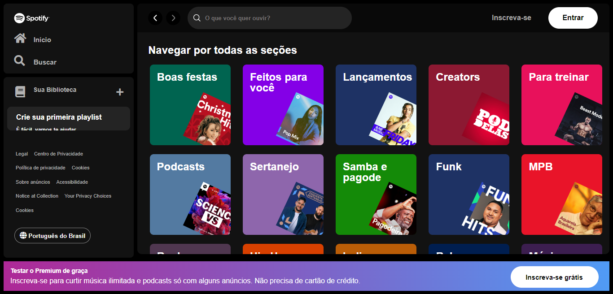

<h1 align="center">Spotify Landing Page</h1>
<p>Projeto de participação da imersão gratuita sobre front-end realizada pela Alura em 2024, onde foi apresentado as principais tecnologias utilizadas nesse ramo de desenvolvimento. Durante a imersão, recriamos a página de playlists do Spotify para fixar o conteúdo aprendido.</p>

## 📄 Notas:
- O projeto não está responsivo e pode não funcionar perfeitamente em diferentes resoluções;
- Não é recomendado a visualização pelo smartphone, pois ainda não está configurado para isso.

## ⚙ Requisitos
- IDE de preferência do usuário;
- NodeJS
- JSON server.

## 🎵 Como utilizar

**siga os passos a seguir:**
1. Clone este repositório para o seu computador usando:<br>
   ```git clone https://github.com/KarlosEKaminski/alura-imersao-frontend-2024.git```
3. Abra o projeto em sua IDE favorita.
4. Abra o terminal e utilize: ```cd spotify-landing-page-clone``` para ir até o diretório do projeto.
5. Utilize o comando: ```json-server --watch api-artists/artists.json --port 3000``` para iniciar o servidor JSON.
6. Abra o arquivo **_index.html_**.
7. Compare com o site oficial: https://open.spotify.com/search

## 📸 Screenshot
<div style="display: flex;">
   <p align="center">
      
   </p>
</div>
